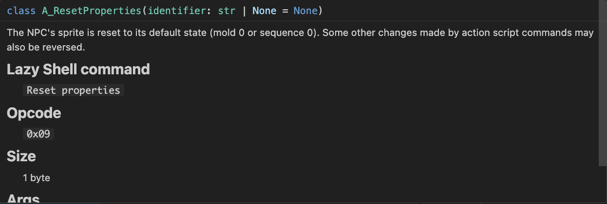
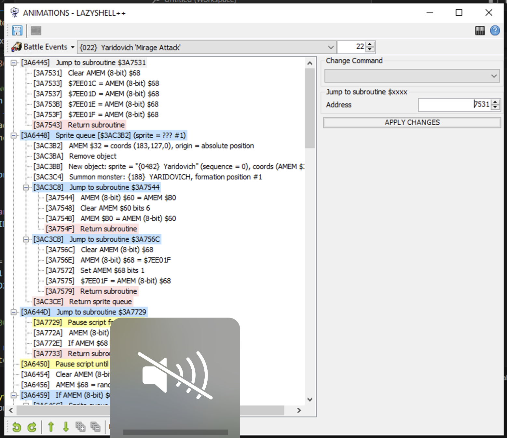
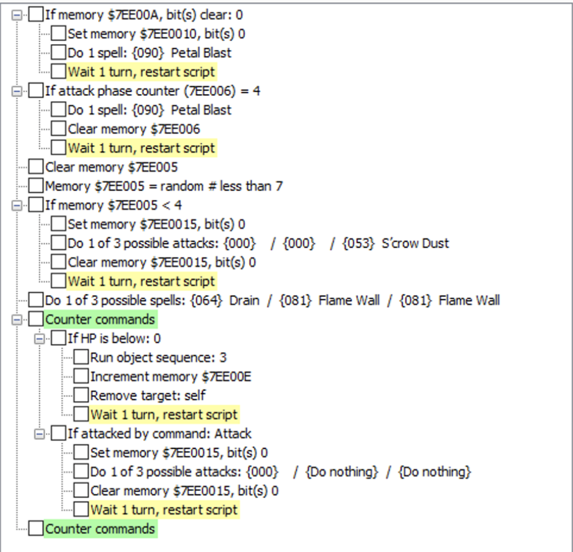
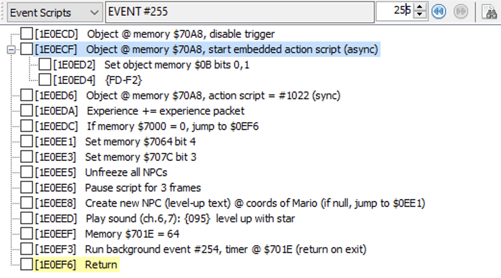
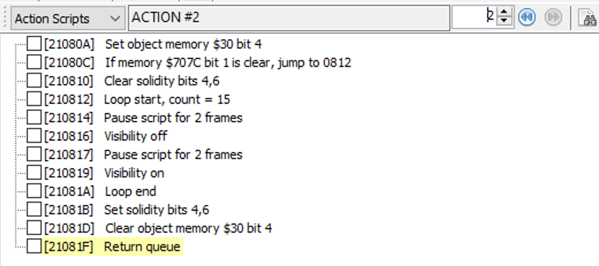

# SMRPG Patch Builder

Freeform editing of various kinds of SMRPG scripts and sprites. 

This is not a decomp.

# How this works: converting your ROM's scripts into Python code

You can disassemble the contents of your ROM, which turns your ROM into Python code like this:

```python
# This is event 32, which is for treasure chests that don't contain coins
script = EventScript([
	JmpToEvent(E3072_FLOWER_STAR_FC_OR_MUSHROOM_CHEST)
])
```

You can edit that however you like. For example you could make a dialog run every time you open a chest (not sure why you'd want to, but you could do it):
```python
script = EventScript([
	RunDialog(
		dialog_id=DI0520_LITTLE_SHORT_ON_COINS,
		above_object=MEM_70A8,
		closable=True,
		sync=False,
		multiline=True,
		use_background=True,
	),
	JmpToEvent(E3072_FLOWER_STAR_FC_OR_MUSHROOM_CHEST)
])
```

If you want to use any `Jump to address` commands, you can do it by putting labels on your commands. You don't need to worry about ROM addresses at all! (However, just like in Lazy Shell, commads in 0x1Exxxx can only jump to other commands in 0x1Exxxx and not in 0x1Fxxxx, etc. These are called **banks** and you can jump to any command in any script as long as it's in the same bank.)
```python
script = EventScript([
	JmpIfBitClear(UNKNOWN_7049_4, ["LabelGoesHere"]), # This will skip the RunDialog command by jumping to the SetBit command
	RunDialog(
		dialog_id=DI0520_LITTLE_SHORT_ON_COINS,
		above_object=MEM_70A8,
		closable=True,
		sync=False,
		multiline=True,
		use_background=True,
	),
	SetBit(INSUFFICIENT_COINS, identifier="LabelGoesHere"),
	JmpToEvent(E3072_FLOWER_STAR_FC_OR_MUSHROOM_CHEST)
])
```

You have total freedom to put commands anywhere you want, just like in Lazy Shell. And then you can convert that Python code back into a patch for your ROM. The names of each command in a script, and the arguments that they take, are meant to resemble how they're written in Lazy Shell.

You don't need a whole lot of coding knowledge if you just want to use these scripts to read, modify, and output a patch for your SMRPG code. But you can import this repo and use its classes in your own Python projects if you like, if for example you're working on something complicated and non-static like SMRPG Randomizer. You can assemble a whole collection of scripts into bytes like this example of the 1Exxxx event script bank:
```python
bank = EventScriptBank(
    pointer_table_start=0x1E0000,
    start=0x1E0C00,
    end=0x1F0000,
    scripts=[
		# This is where you would put all of your EventScript instances, in order
	])
patchbytes = bank.render() # This outputs a bytearray
```

Most of this was designed to be used with smrpg randomizer. A lot of it can be reused, but there'll be a lot of stuff in here that doesn't match up to the original game, like the const names I've given to variables like event IDs, dialog IDs, etc. But you can extend this code's base classes for your purposes however you like.

This repo allows you to parse, modify, and rebuild:
- Battle animations ([disassemble](#disassembling-battle-animations) | [assemble](#assembling-battle-animations))
- Monster AI ([disassemble](#disassembling-monster-ai) | [assemble](#assembling-monster-ai))
- Event scripts and overworld NPC animations  ([disassemble](#disassembling-overworld-scripts) | [assemble](assembling-overworld-scripts))
- Overworld dialogs ([disassemble](#disassembling-dialogs) | [assemble](#assembling-dialogs))
- Items ([disassemble](#disassembling-items) | [assemble](#assembling-items))
- Enemies ([disassemble](#disassembling-enemies) | [assemble](#assembling-enemies))
- Battle dialogs ([disassemble](#disassembling-battle-dialogs) | [assemble](#assembling-battle-dialogs))
- Overworld sprites ([disassemble](#disassembling-sprites) | [assemble](#assembling-sprites))

## Developing and changing your scripts

This repo's tools will output the scripts that are in your ROM. You can then browse them in an editor like VSCode. You can hover over each command to see hints about how to use it as well as what it's based on in Lazy Shell.


There are some commands included that are not in Lazy Shell yet that you can still use here.

If you're looking for a certain Lazy Shell command but don't know what class it is, search the src/smrpgpatchbuilder folder for the Lazy Shell command as it appears in the script editor's command dropdown. That will bring you to the class definition for the command you're looking for.

## How to use this repo's standalone tools

These instructions are for bash terminals, aka mac/linux only (no powershell). If you want to do this on windows you'll need to figure out on your own what the equivalent steps are here (but you can probably use [WSL](https://learn.microsoft.com/en-us/windows/wsl/install) and these steps will likely still work after some finagling).

- Install the Python runtime for your operating system. All further steps assume that your PATH variable will execute python 3 when you use `python` in the command line (and that you don't have that pointing to a separate python 2 install for example)
- Create a virtual environment: `python -m venv MyVirtualEnvironmentNameWhateverIWant`
- Activate the virtual environment: `source ~/.venvs/MyVirtualEnvironmentNameWhateverIWant/bin/activate` (might differ depending on your setup, use google if that's the case)
- Install required packages: `pip install -r requirements.txt`

Everything you do beyond this point must be in your venv. You'll know you're in your venv when your terminal prompts have your venv name in them, like this if you use vscode:

```
(MyVirtualEnvironmentNameWhateverIWant) stefkischak@Stefs-MBP smrpgpatchbuilder %
```

## How to run tests

In your venv:
`PYTHONPATH=src pytest src/tests`

## Do this first

Copy all of the files from the `config.example` folder into the `config` folder. These files are meant for you to give contextual names to certain things in the game, such as rooms, scripts, in-game variables, etc. That way, when disassembling your event scripts into Python files, for example, instead of seeing `EnterArea(5, ...)` you would see `EnterArea(MARRYMORE_OUTSIDE_DURING_BOOSTER, ...)`. The files in config.example default to SMRPG Randomizer's values (TODO: change to original smrpg), you can change them to suit whatever's in your ROM and/or mod. (You also don't need to use the A###_SOME_UPPERCASE_WORD format, you can put whatever text you want and it'll automatically be converted.)

Run PYTHONPATH=src python src/smrpgpatchbuilder/manage.py variableparser, and it will create Python files inside `./src/disassembler_output/variables`. Every other disassembler will read from these and your resulting scripts will import them.

## Battle animations

### Disassembling battle animations

This library allows you to edit battle animations with almost as much freedom as the event script editor in Lazy Shell offers you. You can move commands around, add them, and delete them, without needing to match your replacements byte-by-byte, as long as you stay within the size guidelines given by the script files generated for you. This is because while editing scripts, pointers (including those used for object queues and sprite queues) have names instead of being tied to exact addresses, and their addresses are calculated when you build your ROM patch.

To get your script files, run this **in the root directory of this project** against an SMRPG rom file (vanilla or not). It will read all battle animations it can find and convert them into Python code. For example:

```bash
PYTHONPATH=src python src/smrpgpatchbuilder/manage.py animationdisassembler --rom "path/to/your/smrpg/rom/or/modified/smrpg/rom" 
```

This will output to a subfolder, `./src/disassembler_output/battle_animation`. 

For example, here is part of the Yaridovich mirage attack as seen in Lazy Shell:



Here is the code that the script creates from reading that (battle_events/contents/script_22.py):

```python
# BE0022_YARIDOVICH_MIRAGE_ATTACK

from smrpgpatchbuilder.datatypes.battle_animation_scripts import *
from smrpgpatchbuilder.datatypes.enemies.implementations import *
from smrpgpatchbuilder.datatypes.items.implementations import *

script = BattleAnimationScript(header=["command_0x3a647c"], script = [
	RunSubroutine(["command_0x3a7531"]),
	SpriteQueue(field_object=1, destinations=["queuestart_0x3ac3b2"], bit_2=True, bit_4=True),
	RunSubroutine(["command_0x3a7729"]),
	PauseScriptUntil(condition=FRAMES_ELAPSED, frames=90),
	ClearAMEM8Bit(0x68),
	SetAMEMToRandomByte(amem=0x68, upper_bound=7),
	JmpIfAMEM8BitLessThanConst(0x68, 3, ["command_0x3a646c"]),
	SpriteQueue(field_object=0, destinations=["queuestart_0x3ac345"], bit_2=True, bit_4=True),
	SpriteQueue(field_object=1, destinations=["queuestart_0x3ac35f"], bit_2=True, bit_4=True),
	Jmp(["command_0x3a6476"]),
	SpriteQueue(field_object=1, destinations=["queuestart_0x3ac345"], bit_2=True, bit_4=True, identifier="command_0x3a646c"),
	SpriteQueue(field_object=0, destinations=["queuestart_0x3ac35f"], bit_2=True, bit_4=True),
	RunSubroutine(["command_0x3a771e"], identifier="command_0x3a6476"),
	Jmp(["command_0x3a7550"]),
	SetAMEM32ToXYZCoords(origin=ABSOLUTE_POSITION, x=183, y=127, z=0, set_x=True, set_y=True, set_z=True, identifier="command_0x3a647c"),
	NewSpriteAtCoords(sprite_id=SPR0482_YARIDOVICH, sequence=0, priority=2, vram_address=0x7800, palette_row=12, overwrite_vram=True, looping=True, overwrite_palette=True, behind_all_sprites=True, overlap_all_sprites=True),
	RunSubroutine(["command_0x3a756c"]),
	SummonMonster(monster=Yaridovich, position=1, bit_6=True, bit_7=True)
])
```

This outputs much more code sometimes than you will see in Lazy Shell. This is because this script outputs files for contiguous code blocks regardless of how they are pointed at. So if it finds a subroutine at `0x3a7531` that ends at `0x3a7543` (inclusive) but also finds a subroutine that begins at `0x3a7544`, it will just write one file with both subroutines in it.

Finally, the script outputs python files that import all of these disassembled SMRPG scripts. Here's a short one that contains flower bonus messages, Toad tutorials, and their associated subroutines, aka everything in the 0x02xxxx range:

```python
from smrpgpatchbuilder.datatypes.battle_animation_scripts.types import AnimationScriptBankCollection
from .flower_bonus.export import bank as flower_bonus
from .toad_tutorial.export import bank as toad_tutorial
from .subroutines.export_0x02F50E import bank as subroutine_0x02F50E

collection = AnimationScriptBankCollection([
	flower_bonus,
	toad_tutorial,
	subroutine_0x02F50E,
])
```

(If you are importing this into your own python project, you can use `collection.render()` to get a `Dict[int,bytearray]` where the bytearray is your re-assembled bytes and the int is the ROM address you should begin patching them to.)

Standalone, this will produce a series of files that represent all of the battle animation code your ROM currently uses that the script could find. The output folders will be inside `src`.

Things to be careful about:
- This is very, very much in alpha. You'll find that this takes an extremely long time to complete, to the order of several hours. That's because this script does its best to recursively trace as much code as the game touches, which includes tracking all possible AMEM values when GOTOing different addresses based on what AMEM is (i.e. jump if amem = some number, object queue with index at amem $60, etc). Even though the script will attempt to do this accurately, it can't be done perfectly because of things like `SetAMEMToRandomByte`. For this reason I recommend never changing the start address and expected size of any script file as it is generated for you.
- If you've changed the start or end of any top-level pointer tables in your ROM, then this will not work correctly and you will need to modify the `banks` dict of animationdisassembler.py. (If you're doing this, note the `end` address of a bank dict entry is **inclusive**, not exclusive. Don't ask me why I did it that way because I don't remember).
- Object queues always assume that their pointers point only toward code that comes AFTER it. For example if you define an object queue at $3A1234 and the first pointer is `0x23 0x01`, it might compile correctly, but it will never decompile correctly after that. Be careful to avoid doing this.
- There are some commands in here that are experimental (as in I have a hypothesis about what they do but have not corroborated it against its asm as proof). These commands have "EXPERIMENTAL" in their class names in all caps. These are primarily relevant for the "Ally tries to run" animation, which in the original game includes a pointer to an address that lies halfway through another command. The disassembler attempts to change this destination without breaking the original script's functionality.

### Assembling battle animations

After you've changed the files produced by the disassembler to do whatever you want, you can use this:

```bash
PYTHONPATH=src python src/smrpgpatchbuilder/manage.py animationassembler -r /path/to/rom/you/want/to/patch -t -b
```

- `-r`, `-t`, and `-b` are individually optional, but at least one needs to be used. 
- If you include `-r /path/to/rom/you/want/to/patch`, it will output a bps patch file with the contents of your battle animation files.
- If you include `-t`, it will output plain text files (split up according to the address the byte string starts at) with your assembled bytes. You can use this for debugging, such as if you want to side-by-side compare your results against the Lazy Shell editor's hex. It's all on one line though so it might be hard to use.
- If you include `-b`, it will output binary files (split up according to the address the byte string starts at) that you can paste over sections of your rom using FlexHEX.

The assembler script is really just a glorified wrapper that looks for files in the disassembler output directory and then calls each script bank's `.render()` method and writes the raw output to a file. If you're using the `.render()` method on `AnimationScriptBank`s in your own project, it will return bytearrays that you can do whatever you want with.

Things to be careful about:
- There are a lot of things we don't know about battle animations. Less than half of the opcodes in this script type have been documented. I've done my best to prevent this, but it's possible that some raw byte arrays contain hardcoded pointers, which means if things shift around too much it would break. If this happens, let me know and I'll see if you might have discovered an opcode that uses a pointer, and will integrate it into this code.
- Your script files will be generated with an `expected_size` argument in those scripts. **Don't change these lengths ever.** It gives you a guideline on how long your script can be before you run the risk of overwriting code it doesn't know about. 
- If your modified script is shorter than `expected_size`, that's also okay, the assembler will insert empty code to make up for it.


### Disassembling monster AI

This was based off of the battle disassembler that patcdr made in smrpg randomizer that enabled spell randomization!


Run this **in the root directory of this project** against an SMRPG rom file (vanilla or not). It will read all monster AI scripts and convert them into Python code. For example:

```bash
PYTHONPATH=src python src/smrpgpatchbuilder/manage.py battledisassembler --rom "path/to/your/smrpg/rom/or/modified/smrpg/rom" 
```

This will output to a subfolder, `./src/disassembler_output/monster_ai`. 

For example, here is Megasmilax's AI as seen in Lazy Shell:



Here is the code that the script creates from reading that (scripts/script_204.py):

```python
# 204 - Megasmilax

from smrpgpatchbuilder.datatypes.enemies.implementations import *
from smrpgpatchbuilder.datatypes.items.implementations import *
from smrpgpatchbuilder.datatypes.monster_scripts import *
from smrpgpatchbuilder.datatypes.battle_animation_scripts.ids.battle_events import *

script = MonsterScript([
	IfVarBitsClear(0x7EE00A, [0]),
	SetVarBits(0x7EE00A, [0]),
	CastSpell(PetalBlast),
	Wait1TurnandRestartScript(),
	IfTurnCounterEquals(4),
	CastSpell(PetalBlast),
	ClearVar(ATTACK_PHASE_COUNTER),
	Wait1TurnandRestartScript(),
	ClearVar(DESIGNATED_RANDOM_NUM_VAR),
	Set7EE005ToRandomNumber(upper_bound=7),
	IfVarLessThan(DESIGNATED_RANDOM_NUM_VAR, 4),
	SetVarBits(0x7EE00F, [0]),
	Attack(PhysicalAttack0, PhysicalAttack0, ScrowDust),
	ClearVarBits(0x7EE00F, [0]),
	Wait1TurnandRestartScript(),
	CastSpell(Drain, FlameWall, FlameWall),
	StartCounterCommands(),
	IfHPBelow(0),
	DoMonsterBehaviour(3),
	IncreaseVarBy1(0x7EE00E),
	RemoveTarget(SELF),
	Wait1TurnandRestartScript(),
	IfTargetedByCommand([COMMAND_ATTACK]),
	SetVarBits(0x7EE00F, [0]),
	Attack(PhysicalAttack0, AttackDoNothing, AttackDoNothing),
	ClearVarBits(0x7EE00F, [0]),
	Wait1TurnandRestartScript()
])
```

I didn't bother matching Lazy Shell UI indents to the disassembled output because, well... python.

You will also get a folder in the root of the monster_ai folder, monster_scripts.py, which imports all 256 battle scripts into a `MonsterScriptBank`. If you're using these scripts in your own code, you can import the `MonsterScriptBank` and run its `.render()` method, which will retur a tuple of **two bytearrays**. The first is meant to be patched at `0x3930AA` (where monster AI goes in the original game) and the second is meant to be patched to `0x39F400` (in case your scripts are very long and need some overflow room, the block at `0x39F400` is empty in the original game).

Standalone, this will produce a series of files that represent all of the monster AI code your ROM currently uses that the script could find. The output folders will be inside `src`.

### Assembling monster AI

After you've changed the files produced by the disassembler to do whatever you want, you can use this:

```bash
PYTHONPATH=src python src/smrpgpatchbuilder/manage.py battleassembler -r /path/to/rom/you/want/to/patch -t -b
```

- `-r`, `-t`, and `-b` are individually optional, but at least one needs to be used. 
- If you include `-r /path/to/rom/you/want/to/patch`, it will output a bps patch file with the contents of your battle animation files.
- If you include `-t`, it will output plain text files (split up according to the address the byte string starts at) with your assembled bytes. You can use this for debugging, such as if you want to side-by-side compare your results against the Lazy Shell editor's hex. It's all on one line though so it might be hard to use.
- If you include `-b`, it will output binary files (split up according to the address the byte string starts at) that you can paste over sections of your rom using FlexHEX.

The assembler script is really just a glorified wrapper that imports the disassembler output and then calls the script bank's `.render()` method and writes the raw output to a file. If you're using the `.render()` method on a `MonsterScriptBank` in your own project, it will return 2 bytearrays that you can do whatever you want with (see previous section)

### Disassembling overworld scripts

You can convert all 4096 overworld scripts and 1024 standalone NPC animations into Python code as well. One command will do both at the same time:

```bash
PYTHONPATH=src python src/smrpgpatchbuilder/manage.py eventconverter --rom "path/to/your/smrpg/rom/or/modified/smrpg/rom" 
```

This runs really, really slowly and takes several hours. I originally wrote disassembled events as dicts rather than command classes, and then wrote another script to convert them, so it does one and then the other. Possibly an issue to fix in a future revision, but I couldn't be bothered with how annoying it is to deal with embedded NPC animations.

Here is event 255 as it appears in Lazy Shell:


And here's how it looks when converted to Python:
```python
# E0255_EXP_STAR_HIT

script = EventScript([
	DisableObjectTrigger(MEM_70A8),
	StartSyncEmbeddedActionScript(target=MEM_70A8, prefix=0xF1, subscript=[
		A_SetObjectMemoryBits(arg_1=0x0B, bits=[0, 1]),
		A_Db(bytearray(b'\xfd\xf2'))
	]),
	SetSyncActionScript(MEM_70A8, A1022_HIT_BY_EXP_STAR),
	IncEXPByPacket(),
	JmpIfVarEqualsConst(PRIMARY_TEMP_7000, 0, ["EVENT_255_ret_13"]),
	SetBit(UNKNOWN_MIMIC_BIT, identifier="EVENT_255_set_bit_5"),
	SetBit(EXP_STAR_BIT_6),
	UnfreezeAllNPCs(),
	Pause(3),
	CreatePacketAtObjectCoords(packet=P031_LEVELUP_TEXT, object=MARIO, destinations=["EVENT_255_set_bit_5"]),
	PlaySound(sound=SO095_LEVEL_UP_WITH_STAR, channel=6),
	SetVarToConst(TIMER_701E, 64),
	RunBackgroundEventWithPauseReturnOnExit(event_id=E0254_EXP_STAR_HIT_SUBROUTINE, timer_var=TIMER_701E),
	Return(identifier="EVENT_255_ret_13")
])
```

Similarly, here's action script 2:


And here's how it looks in Python:
```python
#A0002_FLASH_AFTER_RUNNING_AWAY_IFRAMES

script = ActionScript([
	A_ObjectMemorySetBit(arg_1=0x30, bits=[4]),
	A_JmpIfBitClear(TEMP_707C_1, ["ACTION_2_start_loop_n_times_3"]),
	A_ClearSolidityBits(bit_4=True, cant_walk_through=True),
	A_StartLoopNTimes(15),
	A_Pause(2),
	A_VisibilityOff(),
	Pause(2),
	A_VisibilityOn(),
	A_EndLoop(),
	A_SetSolidityBits(bit_4=True, cant_walk_through=True),
	A_ObjectMemoryClearBit(arg_1=0x30, bits=[4]),
	A_Return()
])
```

All action script commands are prefixed with `A_`. This is to distinguish them from event script commands.

Things to be aware of:
- This will produce scripts that add up to exactly the amount of bytes each bank can contain. To free up space, go to the final script (event 4095, action 1023) and delete all of the trailing `EndAll` class instantiators.
- Yo'ster Isle (events 470, 1837, 1839, 3329, 3729) has some weird implementation of this called "non-embedded action queues." That's event script code that's supposed to be read as NPC animation script code, despite having no header to indicate that. Non-embedded action queues are expected to begin at a certain offset relative to the start of the event. You can edit these events if you like, and the assembler will just insert dummy commands to fill space to keep the NEAQ where the game expects it. However, if you have too much code before the NEAQ that pushes it to a greater offset than it needs to be, you'll get an error when building your patch.
- There's a couple of overrides that are technically legal but that you should probably never do. Normally, when you're using commands that jump to other commands, you specify another command's `identifier` property as the destination, so that this code will take care of filling these in with ROM addresses for you. However, event 580 in the original game issues a jump to an address that isn't associated to an event. I've flagged this with `ILLEGAL_JUMP` in the identifier, which means you're allowed in general to use a destination of `ILLEGAL_JUMP_XXXX` where `XXXX` is a four-digit hex int indicating the offset you want to jump to and is unassociated with any other command. I *strongly* recommend against ever doing this.
- Similarly, queue 53 and queue 137 in the original game use sound ID 255. I have no idea what that is, sounds are only supposed to go up to 163 or something like that. This is another thing that's technically legal but that you shouldn't do.

### Assembling overworld scripts

The disassembler produces individual script files as well as two files (events.py and actionqueues.py) that contain them. events.py includes an `EventScriptController` that contains all of the event scripts in 0x1Exxxx, 0x1Fxxxx, and 0x20xxxx, each in their own `EventScriptBank`. Calling the `EventScriptController`'s `render()` method will produce three bytearrays that include a pointer table and script data, one per high byte. Standalone action scripts on the other hand are all contained in 0x21xxxx, so actionqueues.py only contains one `ActionScriptBank` and its `render()` method produces a single bytearray that contains the pointer table and script data in a contiguous block.

After you've edited the script files to do whatever you want, you can assemble event scripts and NPC action scripts back into ROM data in one command, since the assembler is just a glorified wrapper for `render()`:

```bash
PYTHONPATH=src python src/smrpgpatchbuilder/manage.py eventassembler -r /path/to/rom/you/want/to/patch -t -b
```

- `-r`, `-t`, and `-b` are individually optional, but at least one needs to be used. 
- If you include `-r /path/to/rom/you/want/to/patch`, it will output a bps patch file with the contents of your battle animation files.
- If you include `-t`, it will output plain text files (split up according to the address the byte string starts at) with your assembled bytes. You can use this for debugging, such as if you want to side-by-side compare your results against the Lazy Shell editor's hex. It's all on one line though so it might be hard to use.
- If you include `-b`, it will output binary files (split up according to the address the byte string starts at) that you can paste over sections of your rom using FlexHEX.

This will assemble event scripts **and** standalone NPC action scripts.

## Dialogs

### Disassembling overworld dialogs

Dialogs in SMRPG are split into banks 0x22xxxx, 0x23xxxx, 0x24xxxx. You can disassemble dialog info into files that you can more or less edit as text.

Run this **in the root directory of this project** against an SMRPG rom file (vanilla or not). It will read all overworld dialogs and convert them into Python code. For example:

```bash
PYTHONPATH=src python src/smrpgpatchbuilder/manage.py dialogdisassembler --rom "path/to/your/smrpg/rom/or/modified/smrpg/rom" 
```

This will output to a subfolder, `./src/disassembler_output/dialogs`. This one's a bit slower, I could have written the code a lot better, oh well.

You'll see a file called dialogs.py:

```python
from smrpgpatchbuilder.datatypes.dialogs.classes import DialogCollection
from .contents.dialog_pointers import pointers
from .contents.dialog_table_0x22 import dialog_data as data_0
from .contents.dialog_table_0x23 import dialog_data as data_1
from .contents.dialog_table_0x24 import dialog_data as data_2

data = DialogCollection(pointers, [data_0, data_1, data_2], ...)
```

A `DialogCollection` represents all of the dialog in the game. If you're importing this in your own project, `.render()` will produce a `Dict[int, bytearray]` where the int is the address to patch the bytearray at.

Disassembled dialog data is split up into two parts. You'll see three files full of actual dialog data that look like this:
```python
dialog_data[315] = ''' Thanks a million, Mario!
 Say[delay][delay],...[delay][delay]were my treasures OK?[await]
 [select]  (They sure were)
 [select]  (I wouldn't say so)[await]'''
dialog_data[316] = ''' Oh! That’s great news!
 What a relief![await]'''
```

And one pointer file that looks like this:
```python
...
pointers[793] = Dialog(bank=0x22, index=315, pos=22)
pointers[794] = Dialog(bank=0x22, index=316, pos=0)
...
```

The data files contain the actual dialog text. They're broken up into individual strings based on where text-terminating characters were in the original game. You can add or delete dialogs in these tables as you like (I think), as long as the whole file doesn't have too much text to fit into the ROM.

The pointer table is what you'll need to make your dialogs work. Don't change the length of this table or any of the `bank` properties.
The `index` property corresponds to which entry in the data file you want. So in the above example, dialog 793 references data entry 315 (in the 0x22 file, as indicated by the `bank` property), which is the "Thanks a million, Mario!" dialog. To use this in your romhack, you'd run dialog ID 793 in your event scripts to get a NPC to say that.
The `pos` property determines where the dialog should actually start. In the first example, `pos=22` means that the dialog will actually start after 22 characters. So if you run dialog 793 in your event script, the NPC will actually start talking at "Say... were my treasures OK?"

"But wait, there's more than 22 characters before that!" Yes - this script also reads your ROM's **compression table**. The string "in" is represented by a single byte, 0x10. SMRPG has space for twelve such compressions that use bytes 0x0E through 0x19 inclusive. The disassembler will parse the compression table in your rom and include it in the output dialogs.py file. Because the text is disassembled in full, you have the freedom to change your compression table if you like, and it will be applied to your text when you patch.

You'll also see that some special characters I've represented with directives like `[await]` and `[pause]` etc, just so that it's easier for you to understand what's actually happening in the dialog. These are single bytes in the game as well and they will be assembled as such.

### Assembling dialogs

After you've changed the dialog data files output by the disassembler, including changing your compression table in dialogs.py if you like, you can run:

```bash
PYTHONPATH=src python src/smrpgpatchbuilder/manage.py dialogassembler -r /path/to/rom/you/want/to/patch -t -b
```

- `-r`, `-t`, and `-b` are individually optional, but at least one needs to be used. 
- If you include `-r /path/to/rom/you/want/to/patch`, it will output a bps patch file with the contents of your battle animation files.
- If you include `-t`, it will output plain text files (split up according to the address the byte string starts at) with your assembled bytes. You can use this for debugging, such as if you want to side-by-side compare your results against the Lazy Shell editor's hex. It's all on one line though so it might be hard to use.
- If you include `-b`, it will output binary files (split up according to the address the byte string starts at) that you can paste over sections of your rom using FlexHEX.

The assembler script is really just a glorified wrapper that looks for files in the disassembler output directory and then calls the dialog collection's `.render()` method and writes the raw output to a file. If you're using the `.render()` method on a `DialogCollection` in your own project, it will return 2 bytearrays that you can do whatever you want with (see previous section)

## Battle Dialogs

### Disassembling battle dialogs

You can disassemble all 256 battle dialog entries from the ROM into editable text.

Run this in the root directory of this project against an SMRPG ROM file. For example:

```bash
PYTHONPATH=src python src/smrpgpatchbuilder/manage.py battledialogdisassembler --rom "path/to/your/smrpg/rom"
```

This will output to `./src/disassembler_output/battle_dialogs/battle_dialogs.py`. The file contains a list of 256 battle dialog strings that you can edit directly:

```python
battle_dialogs = [""]*256
battle_dialogs[0] = 'First battle dialog...'
battle_dialogs[1] = 'Second battle dialog...'
```

I've added a few special tags like like `[pause]`, `[delay]`, and `[await]` which compile back into respective single bytes when assembled.

### Assembling battle dialogs

After editing the battle dialog file, you can assemble it back into ROM data:

```bash
PYTHONPATH=src python src/smrpgpatchbuilder/manage.py battledialogassembler -r /path/to/rom/you/want/to/patch -t -b
```

- `-r`, `-t`, and `-b` are individually optional, but at least one needs to be used.
- If you include `-r /path/to/rom/you/want/to/patch`, it will output a bps patch file with the battle dialog data.
- If you include `-t`, it will output plain text files with your assembled bytes for debugging.
- If you include `-b`, it will output binary files that you can paste over sections of your ROM using FlexHEX.

## Items

### Disassembling items

You can disassemble all 256 items from the ROM, including their stats, names, descriptions, and properties.

Run this in the root directory of this project against an SMRPG ROM file (vanilla or not). For example:

```bash
PYTHONPATH=src python src/smrpgpatchbuilder/manage.py itemdisassembler --rom "path/to/your/smrpg/rom/or/modified/smrpg/rom"
```

This will output to `./src/disassembler_output/items/items.py` by default.

The disassembler will generate Python classes for each item. For example, here's what the Hammer item looks like:

```python
class Hammer(Weapon):
    """Hammer item class"""
    _item_name: str = "Hammer"
    _prefix = ItemPrefix.HAMMER

    _item_id: int = 5
    _description: str = " Pounds enemies"
    _equip_chars: List[PartyCharacter] = [MARIO]
    _attack: int = 10
    _variance: int = 1
    _price: int = 70
    _hide_damage: bool = True
    _half_time_window_begins = UInt8(8)
    _perfect_window_begins = UInt8(14)
    _perfect_window_ends = UInt8(20)
    _half_time_window_ends = UInt8(38)
```

It is assumed (for now) that the item subclass ranges are as follows:
- **Items 0-36**: weapons
- **Items 37-73**: armor
- **Items 74-95**: accessory
- **Items 96-255**: regular items

**Item Prefixes:**

The symbol that (optionally) appears at the beginning of your item name is stored as an item property. If your ROM is modified such that any of the symbols are different from the original game, you can define them in `config/item_prefixes.input`.

**ItemCollection:**

The disassembler creates an `ItemCollection` containing all 256 items:

```python
ALL_ITEMS = ItemCollection([
    DummyWeapon(),
    DummyArmor(),
    DummyAccessory(),
    ...
])
```

If you're using this in your own Python project, you can use `ItemCollection().render()` to get a `Dict[int, bytearray]` where the int is the ROM address to patch the bytearray at.

### Assembling items

After editing the generated item classes, you can assemble them back into ROM data. The assembler reads from the disassembler output directory.

```bash
PYTHONPATH=src python src/smrpgpatchbuilder/manage.py itemassembler -r /path/to/rom/you/want/to/patch -t -b
```

- `-r`, `-t`, and `-b` are individually optional, but at least one needs to be used.
- If you include `-r /path/to/rom/you/want/to/patch`, it will output a bps patch file with the contents of your items.
- If you include `-t`, it will output plain text files with your assembled bytes for debugging.
- If you include `-b`, it will output binary files that you can paste over sections of your ROM using FlexHEX.

## Enemies

### Disassembling enemies

Before disassembling enemies, you must first disassemble items and battle animations. This is because enemy classes need to know what items to drop and where the pointers for sprite behaviours are.

Run this in the root directory of this project against an SMRPG ROM file (vanilla or not). For example:

```bash
# First, disassemble items (if you haven't already)
PYTHONPATH=src python src/smrpgpatchbuilder/manage.py itemdisassembler --rom "path/to/your/smrpg/rom"

# Next, disassemble battle animations (if you haven't already)
PYTHONPATH=src python src/smrpgpatchbuilder/manage.py animationdisassembler --rom "path/to/your/smrpg/rom"

# Finally, disassemble enemies
PYTHONPATH=src python src/smrpgpatchbuilder/manage.py enemydisassembler --rom "path/to/your/smrpg/rom"
```

By default, this outputs to `./src/disassembler_output/enemies/enemies.py`. You can specify a different animation bank file with the `-a` flag if needed.

The disassembler generates Python classes for each enemy. For example, here's what the Goomba enemy looks like:

```python
class GOOMBA(Enemy):
    """GOOMBA enemy class"""
    _monster_id: int = 6
    _name: str = "GOOMBA"

    _hp: int = 16
    _fp: int = 100
    _attack: int = 3
    _defense: int = 3
    _magic_attack: int = 1
    _magic_defense: int = 1
    _speed: int = 13
    _evade: int = 0
    _magic_evade: int = 0
    _weaknesses: List[Element] = [Element.FIRE]
    _xp: int = 1
    _coins: int = 0
    _yoshi_cookie_item = Mushroom
    _flower_bonus_type: FlowerBonusType = FlowerBonusType.HP_MAX
    _flower_bonus_chance: int = 30
    _morph_chance: float = 100
    _sound_on_hit: HitSound = HitSound.BITE
    _sound_on_approach: ApproachSound = ApproachSound.SPARKY_GOOMBA_BIRDY
    _coin_sprite: CoinSprite = CoinSprite.NONE
    _entrance_style: EntranceStyle = EntranceStyle.LONG_JUMP
    _monster_behaviour: str = "monster_behaviours_1_pointer_table"
    _psychopath_message: str = " Goomba gumba...phew![await]"
```

The disassembler creates an `EnemyCollection` containing all 256 enemies:

```python
ALL_ENEMIES = EnemyCollection([
    Goomba(),
    Spikey(),
    ...
])
```

If you're using this in your own Python project, you can use `EnemyCollection().render(animation_pointers)` to get a `Dict[int, bytearray]` where the int is the ROM address to patch the bytearray at.

### Assembling enemies

After editing the generated enemy classes, you can assemble them back into ROM data. The assembler reads from the disassembler output directory and once again requires the animation bank for behavior pointers.

```bash
PYTHONPATH=src python src/smrpgpatchbuilder/manage.py enemyassembler -r /path/to/rom/you/want/to/patch -t -b
```

- `-r`, `-t`, and `-b` are individually optional, but at least one needs to be used.
- If you include `-r /path/to/rom/you/want/to/patch`, it will output a bps patch file with the enemy data.
- If you include `-t`, it will output plain text files with your assembled bytes for debugging.
- If you include `-b`, it will output binary files that you can paste over sections of your ROM using FlexHEX.
- Use `-a` to specify a custom animation bank path (default: `src/disassembler_output/battle_animation/35/export.py`)

## NPC Sprites

NPC sprites use uncompressed tiles, an image pack, an animation pack, and a container that references all three of those things. These all exist in different parts of the ROM. 

If you're disassembling a ROM where you haven't moved any of this info to a different part of the ROM, you can just copy and paste the config files from the config.example folder. If you're disassembling a romhack that has moved any of this data, you can define the ranges in the config files.

- tiles_read.input - uncompressed tiles (accepts multiple ranges)
- imagepack_read.input - image packs (only accepts one range)
- animationpack_read.input - animation packs (accepts multiple ranges, but hasn't been tested with more than one)
- toplevelsprite_read.input - containers (only accepts one range)

When assembling sprites, you can specify where you want them to be written:
- tiles_write.input - uncompressed tiles (accepts multiple ranges, but be sure to break them up by upper byte so that pointers work correctly, see example file)
- animationdata_write.input - animation pack data (accepts multiple ranges)
- Image packs and animation data pointers will be written to the same place it reads from, starting at the address you specify in imagepack_read.input
- Containers also will be written to the same place specified in toplevelsprite_read.input


### Disassembling sprites

```bash
PYTHONPATH=src python src/smrpgpatchbuilder/manage.py graphicsdisassembler --rom /mnt/d/smrpg.sfc
```

I don't recommend doing very much with this unless you're trying to extract a sprite from a modified rom and insert it into whatever python project you're working on. NPC sprites disassembled look like this:

```python
from smrpgpatchbuilder.datatypes.graphics.classes import CompleteSprite, AnimationPack, AnimationPackProperties, AnimationSequence, AnimationSequenceFrame, Mold, Tile, Clone
sprite = CompleteSprite(
    animation=AnimationPack(0, length=31, unknown=0x0002,
        properties=AnimationPackProperties(vram_size=2048,
            molds=[
                Mold(0, gridplane=False,
                    tiles=[
                        Tile(mirror=False, invert=False, format=0, length=7, subtile_bytes=[
                            bytearray(b'\xff\xf0\xff\xc0\xff\x80\xff\x80\xff\x00\xff\x00\xff\x00\xff\x00\x0f\xff?\xff\x7f\xff~\xfe\xfe\xfe\xfe\xfe\xfe\xfe\xe0\xe0'),
                            bytearray(b'\xff\x0f\xff\x03\xff\x01\xff\x01\xff\x00\xff\x00\xff\x00\xff\x00\xf0\xff\xfc\xff\xfe\xff~\x7f\x7f\x7f\x7f\x7f\x7f\x7f\x07\x07'),
                            bytearray(b'\xff\x00\xff\x00\xff\x00\xff\x00\xff\x80\xff\x80\xff\xc0\xff\xf0\xe0\xe0\xfe\xfe\xfe\xfe\xfe\xfe~\xfe\x7f\xff?\xff\x0f\xff'),
                            bytearray(b'\xff\x00\xff\x00\xff\x00\xff\x00\xff\x01\xff\x01\xff\x03\xff\x0f\x07\x07\x7f\x7f\x7f\x7f\x7f\x7f~\x7f\xfe\xff\xfc\xff\xf0\xff'),
                        ], is_16bit=False, y_plus=0, y_minus=0, x=120, y=120),
                    ]
                ),
            ],
            sequences=[
                AnimationSequence(
                    frames=[
                        AnimationSequenceFrame(duration=16, mold_id=0),
                    ]
                ),
            ]
        )
    ),
    palette_id=0,
    palette_offset=0,
    unknown_num=8
)
```

That looks like a lot of gibberish. It's a (mostly) complete text representation of a sprite, including its image properties and animation properties (instead of referencing by ID).

Disassembly will produce a `SpriteCollection` with all of the NPC sprites in your ROM broken down like this.

Palettes are not yet supported as part of this.

### Assembling sprites

```bash
PYTHONPATH=src python src/smrpgpatchbuilder/manage.py graphicsassembler --rom /mnt/d/smrpg.sfc -t -b
```

The assembler will loop through every sprite in your `SpriteCollection` and figure out which sprites use similar tile data, animation data, etc. It will attempt to arrange your sprites in such a way that duplicate tiles are minimized and as much empty space for extra tiles is opened up for you as much as possible. Image properties and animation properties are created on the fly based on this. Because of how this works, if you disassemble a ROM's sprites and then assemble the output and then patch it onto the same ROM, the bytes will not be identical to how they were before. The sprites should look exactly the same in lazy shell, the bytes are just rearranged.

This is accomplished by moving some of the animation data in 0x364000-0x370000 into other blank areas of the ROM (since animation pointers use 3 bytes), which opens up more space for tiles. Be aware that any tile data written to an address higher than 0x330000 will not render correctly in Lazy Shell but should work in game.

This only really works with a vanilla rom because it assumes that certain sections of the ROM are empty. I would welcome a PR that allows a user to input custom ROM ranges to write sprite data to.